<table>
  <tr>
    <td colspan="2" valign="top">
      

        
        
        
      

    </td>
  </tr>
  <tr>
    <td valign="top" rowspan="2">
      

        
        
      

    </td>
    <td valign="top">
      

        
        <a href="https://www.luas.kr">Move To Blog</a>
      

    </td>
  </tr>
  <tr>
    <td valign="top">
      

        
        
      

    </td>
  </tr>
  <tr>
    <td colspan="2">
      

        
      

    </td>
  </tr>
</table>
